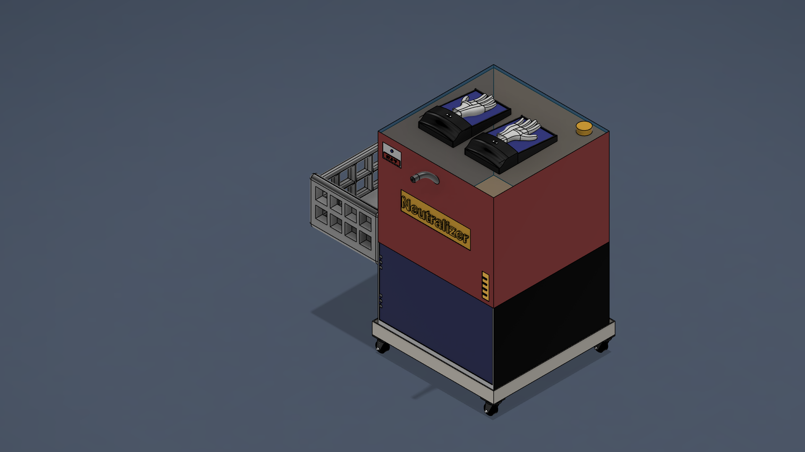
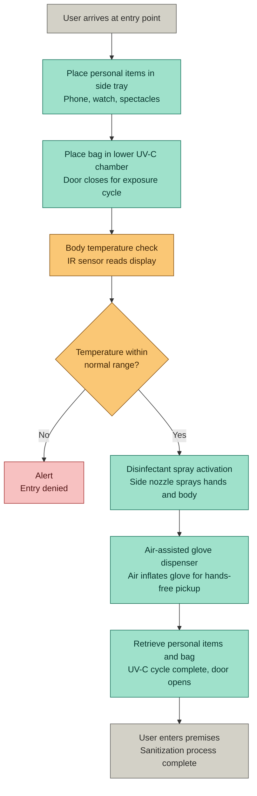
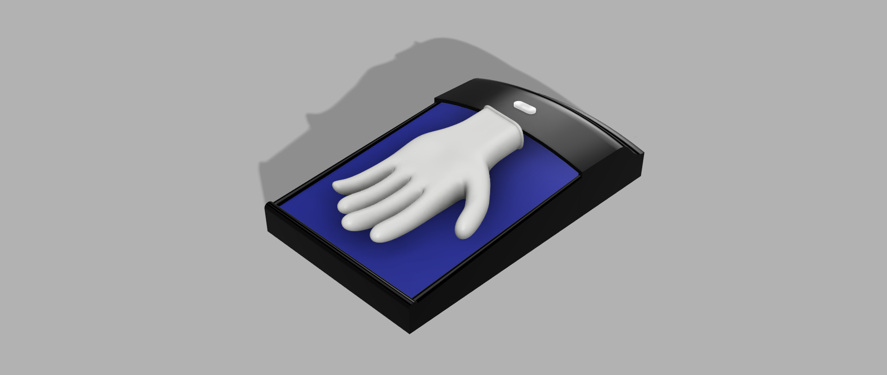
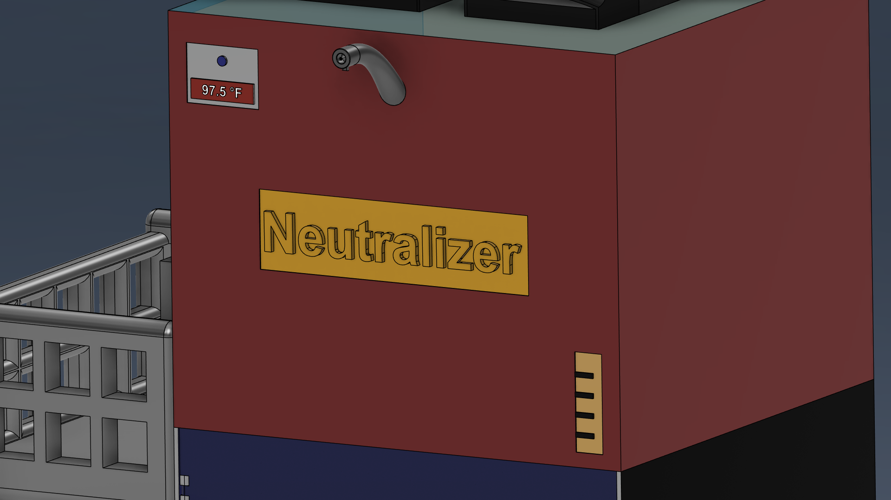
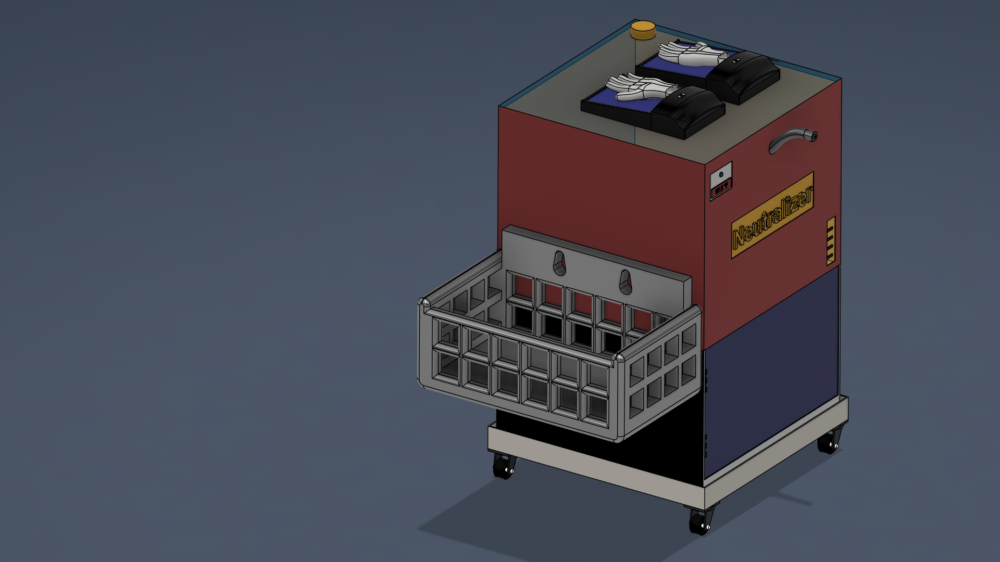
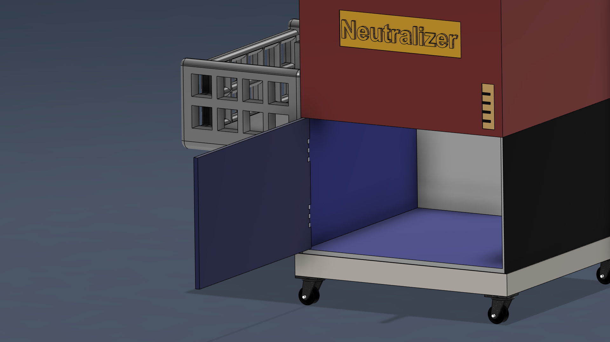
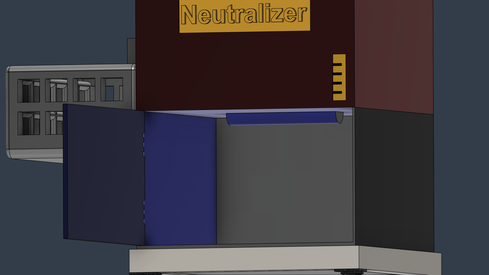
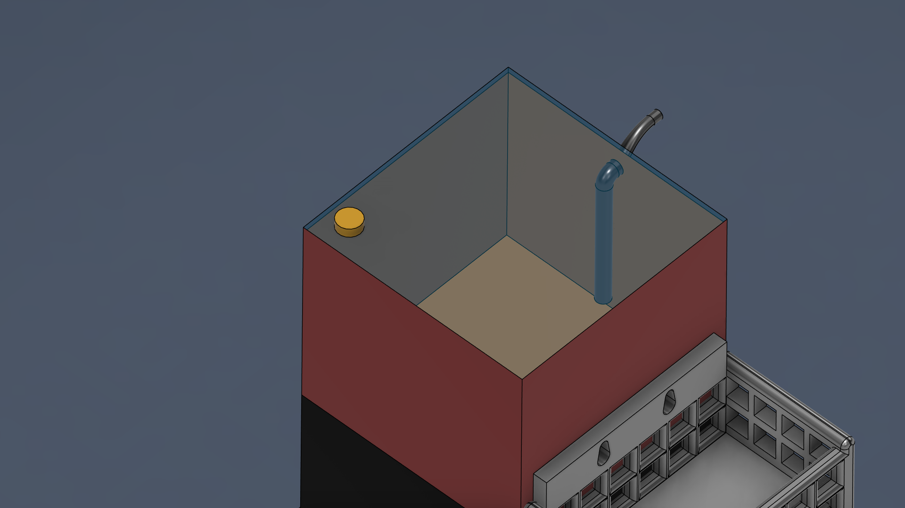

# Neutralizer — Automatic Sanitization Station

**Type:** CAD Concept Design | Hackathon Project  
**Event:** Autodesk Student Hackathon — 2nd Place 🏆  
**Institution:** Gujarat Technological University, India  
**Date:** October 2020  
**Team Size:** 3 members  
**Tool:** Autodesk Fusion 360 (Education License)

---

## Overview

The Neutralizer is a multi-function automatic sanitization station designed as a concept response to the COVID-19 pandemic. The challenge brief required a contactless hygiene solution for students, faculty, and visitors entering university premises — minimising surface contact at entry points while addressing hand hygiene, personal item safety, and body temperature screening in a single integrated unit.

The project was developed entirely in Fusion 360 as a full 3D CAD assembly. All three team members contributed across modelling, subsystem concept development, and presentation. The team was awarded **2nd place** in the Autodesk Student Hackathon, evaluated by a jury panel.

> **Note:** This is an academic CAD concept project, not a tested or certified medical device. Sanitization claims are design intentions based on known technologies. Effectiveness depends on implementation, calibration, and real-world testing.

---

## Design Goals

- Eliminate or minimise touchpoints during the entry sanitization process
- Address multiple hygiene vectors in a single station: hands, body surface, and personal items
- Enable contactless glove dispensing for users who require additional protection
- Create a mobile, repositionable unit suitable for institutional deployment
- Integrate a simple fever screening mechanism at the point of entry

---

## User Flow

The diagram below shows the intended step-by-step process a user follows when interacting with the Neutralizer at a university entry point.

---

## System Components

### 1. Air-Assisted Glove Dispenser (Top Module)

Two glove dispenser units sit on the top surface of the station. The mechanism is inspired by pneumatic glove dispensers (AeroGlove-style): a controlled airflow inflates the glove cuff, holding it open so the user can insert their hand without touching the dispenser housing. This removes one of the most common contact points in glove dispensing workflows.

### 2. Disinfectant Spray Nozzle (Side-Mounted)

A curved nozzle on the side face of the station is connected to an internal liquid sanitizer tank with a fill cap (visible from the top section). The nozzle directs disinfectant spray toward the user for hand and body surface sanitization. The tank is accessible for refilling from the top.

### 3. Temperature Display Panel (Front Face)

The front panel includes a sensor readout showing body temperature (shown as 97.5 °F in the model). This was conceptualised as an infrared proximity temperature check at the point of interaction — an early screening step before the user proceeds through the sanitization sequence.

### 4. Side Tray / Personal Item Holder

A slatted basket tray extends from the side of the unit. Users place small personal items — phone, watch, spectacles — into the tray while the sanitization process takes place, keeping them separate and accessible without requiring the user to set them on an uncontrolled surface.

### 5. UV-C Sanitization Chamber (Lower Compartment)

The lower enclosed section of the Neutralizer is designed as a UV-C exposure chamber for external bag surfaces. A hinged door allows bags and larger personal items to be placed inside. The chamber is intended to reduce surface contamination on external bag surfaces through UV-C light exposure.

> **Design note on UV-C:** UV-C sanitization effectiveness depends on several factors — line-of-sight exposure, lamp intensity, exposure duration, and surface geometry. Bags with folds, pockets, or irregular surfaces may have shadowed areas that receive limited or no UV-C exposure. This design is a concept intended to reduce surface contamination on reachable external surfaces, not a guarantee of full sterility. Proper implementation would require calibrated lamp placement, timed exposure cycles, and safety shielding for the user.

### 6. Sanitizer Liquid Tank (Internal)

Visible in the top-down section view, the internal tank holds the disinfectant liquid and feeds the side spray nozzle via an internal pipe. A yellow-capped fill port is accessible from the top surface for maintenance and refilling.

### 7. Mobile Wheeled Base

The entire unit sits on a four-caster wheeled platform, allowing the station to be repositioned across entry points without disassembly. The base includes a structural frame to support the unit's full weight including the internal tank when filled.

---

## CAD Assembly Structure

The Fusion 360 assembly consists of the following key bodies and components:

| Component | Description |
|---|---|
| Gloves Dispenser Body (×2) | Dual top-mounted pneumatic glove dispenser units |
| Nozzle | Side-mounted disinfectant spray nozzle |
| Tray | Slatted personal item basket, side-mounted |
| Pipe | Internal feed line from sanitizer tank to nozzle |
| Door | Hinged access door for the UV-C lower chamber |
| Wheel Stand | Four-caster mobile base frame |

---

## Engineering Considerations

| Aspect | Detail |
|---|---|
| Contact reduction | All key interactions (glove pick-up, spray, temperature read) are contactless |
| UV-C caveat | Effectiveness is line-of-sight dependent — shadowed bag surfaces may not receive full exposure |
| Modularity | Unit is self-contained and mobile; no fixed installation required |
| Maintenance access | Fill cap on top for sanitizer refill; door access for UV-C lamp servicing (conceptual) |
| Temperature screening | Front panel display integrates early fever detection into the entry flow |

---

## Tools Used

- **Autodesk Fusion 360** (Education License) — full 3D solid modelling and assembly
- **Fusion 360 Render Environment** — product renders for documentation

---

## Awards

🥈 **2nd Place — Autodesk Student Hackathon (2020)**  
Evaluated by a jury panel on design creativity, problem-solving approach, and CAD execution.  
*(Certificate of achievement awarded)*

---

## Design Inspiration & References

### Pneumatic Glove Dispensers
The air-assisted glove mechanism draws inspiration from established pneumatic glove dispensers widely used in healthcare and laboratory settings. These devices use controlled airflow to keep gloves open and ready for hands-free insertion, eliminating a key contact point in hygiene workflows.

**Reference:** AeroGlove® Automatic Glove Dispenser — https://www.briancummins.com.au/AEROGLOVDISPBATT/

### UV-C Surface Sanitization
UV-C light exposure is a proven technology for reducing surface contamination on high-touch items. Hospitals, airports, and laboratories deploy UV-C sanitization cabinets for personal protective equipment, phones, and bags.

**References:**
- WHO guidance on surface decontamination: https://www.who.int/news-room/q-a-detail/coronavirus-disease-covid-19-surface-contamination
- UV-C disinfection in healthcare: https://www.ncbi.nlm.nih.gov/pmc/articles/PMC7428803/ (Journal of Hospital Infection)
- Airport UV-C screening systems (deployed 2020-2021): Industry practice during COVID-19 pandemic

### Temperature Screening
Infrared non-contact thermometers and thermal screening have become standard at institutional entry points for early fever detection.

---

## Disclaimer

This project is an academic CAD concept developed during a student hackathon in 2020. It has not been prototyped, tested, or validated as a medical or safety device. UV-C sanitization, temperature screening, and disinfectant spray mechanisms are design concepts based on existing technologies. Real-world implementation would require engineering validation, regulatory review, and safety testing.
